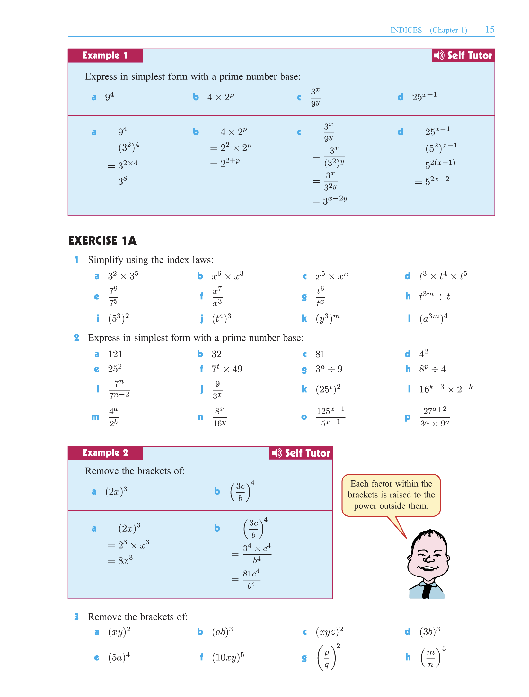
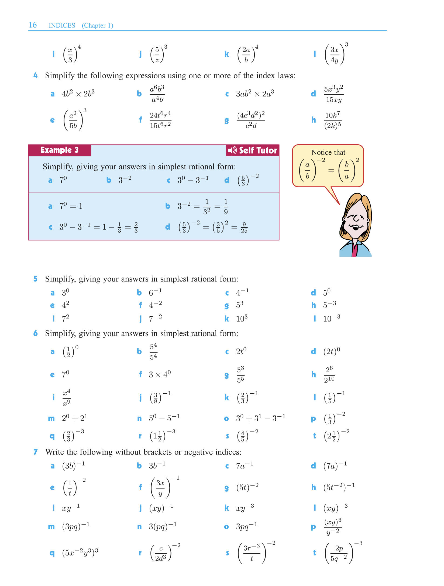

# Chapter 1 - Indices

## 1.1 - Introduction

In mathematics, indices refer to the power to which a number is raised. 

For example, in the expression $2^3$, 
* the number 2 is called the **base** 
* the number 3 is called the **index** (or the **exponent**). 

The expression $2^3$ is read as "two **to the power** of three" or "two cubed". 

$$ 2^3 = 2 \times 2 \times 2 $$

More generally, if $n$ is a positive integer, then $a^n$ is the product of $n$ **factors** of $a$.

$$a^n = a \times a \times a \times \ldots \times a$$

### Exercise 1.1

## 1.2 - Laws of Indices

1. $$a^m \times a^n = a^{m+n}$$
2. $$\frac{a^m}{a^n} = a^{m-n}$$
3. $$(a^m)^n = a^{mn}$$
4. $$(ab)^n = a^n \times b^n$$
5.  $$\left(\frac{a}{b}\right)^n = \frac{a^n}{b^n}$$
6. $$a^0 = 1, ~~~~~~~ (a \neq 0) $$
7. $$a^{-n} = \frac{1}{a^n}$$

Except for **6**, the above can be derived from the definition of indices. 

### Exercise 1.2

Try to derive **1** and **2** from the definition of indices.

### Exercise 1.3

