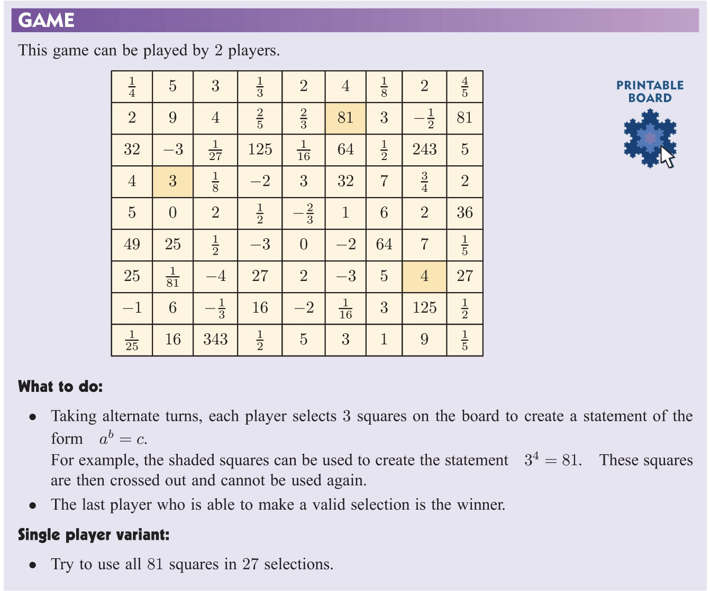

# Chapter 1 - Indices

## 1.1 - Introduction

In mathematics, indices refer to the power to which a number is raised. 

For example, in the expression $2^3$, 
* the number 2 is called the **base** 
* the number 3 is called the **index** (or the **exponent**). 

The expression $2^3$ is read as "two **to the power** of three" or "two cubed". 

$$ 2^3 = 2 \times 2 \times 2 $$

More generally, if $n$ is a positive integer, then $a^n$ is the product of $n$ **factors** of $a$.

$$a^n = a \times a \times a \times \ldots \times a$$

### Exercise 1.1

## 1.2 - Laws of Indices

1. $$a^m \times a^n = a^{m+n}$$
2. $$\frac{a^m}{a^n} = a^{m-n}$$
3. $$(a^m)^n = a^{mn}$$
4. $$(ab)^n = a^n \times b^n$$
5.  $$\left(\frac{a}{b}\right)^n = \frac{a^n}{b^n}$$
6. $$a^0 = 1, ~~~~~~~ (a \neq 0) $$
7. $$a^{-n} = \frac{1}{a^n}$$

Except for **6**, the above can be derived from the definition of indices. 

### Exercise 1.2

Try to derive **1** and **2** from the definition of indices.

### Exercise 1.3

## 1.3 - Rational Indices

### Review - Negative Indices

$$a^{-n} = \frac{1}{a^n}$$

* Example: $2^{-3} = \frac{1}{2^3} = \frac{1}{8}$

* Exercise: Simplify the following expressions.

  1. $3^{-2}$
  2. $\left(\frac{2}{3}\right)^{-3}$

### Rational Number

Rational numbers are numbers that can be expressed as a fraction of two integers.

$$\frac{p}{q}$$

where $p$ and $q$ are integers and $q \neq 0$.

* Example 1: $\frac{1}{2}$ is a rational number because it can be expressed as $\frac{p}{q}$, where $p = 1$ and $q = 2$.
* Example 2: Is $\pi$ a rational number? Is $\sqrt{2}$ a rational number?

*Could you give an example like the above?*

### Roots

The $n$th root of a number $a$ is a number $b$ such that $b^n = a$.

$$\sqrt[n]{a} = b$$

when $n$ is 2, we usually omit the index.

$$\sqrt{a} = b$$

* Example 1: $\sqrt{9} = 3$ because $3^2 = 9$. 
* Example 2: $\sqrt[3]{8} = 2$ because $2^3 = 8$.

*Could you give an example like the above?*

### Converting Rational Indices to Roots

We can extend the definition of indices to rational numbers.

The $1/n$-th power of a number $a$ is equal to the $n$-th root of $a$.

$$a^{\frac{1}{n}} = \sqrt[n]{a}$$

* Example 1: $2^{\frac{1}{2}} = \sqrt{2}$
* Example 2: $2^{\frac{1}{3}} = \sqrt[3]{2}$
* Example 3: $49^{-\frac{1}{2}} = \frac{1}{\sqrt{49}} = \frac{1}{7}$

*Could you give an example like the above?*

### Converting Roots to Rational Indices

It also works the other way round.

$$\sqrt[n]{a} = a^{\frac{1}{n}}$$

* Example 1: $\sqrt{2} = 2^{\frac{1}{2}}$
* Example 2: $\sqrt[3]{2} = 2^{\frac{1}{3}}$
* Example 3: $\frac{1}{\sqrt{49}} = 49^{-\frac{1}{2}}$

*Could you give an example like the above?*

### Unifying Laws in Square Roots and Rational Indices

$$\sqrt{2} \times \sqrt{2} = 2$$

is equivalent to

$$2^{\frac{1}{2}} \times 2^{\frac{1}{2}} = 2^{1} = 2$$

*Could you give an example like the above?*

### Universal Laws of Rational Indices

**Positive Rational Indices**

$$ a^{\frac{m}{n}} = \sqrt[n]{a^m} $$

In order to understand this, we need to understand the meaning of $a^{\frac{m}{n}}$.

$$ a^{\frac{m}{n}} = (a^m)^{\frac{1}{n}} = \sqrt[n]{\underbrace{a \times a \times \ldots \times a}_{m \text{ times}}} = \sqrt[n]{a^m} $$

Another way to understand this:

$$ a^{\frac{m}{n}} = \left(a^{\frac{1}{n}}\right)^m 
= \underbrace{\left(\sqrt[n]{a}\right) \times \left(\sqrt[n]{a}\right) \times \ldots \times \left(\sqrt[n]{a}\right)}_{m \text{ times}} = \sqrt[n]{a^m} $$

**Negative Rational Indices**

$$ a^{-\frac{m}{n}} = \frac{1}{a^{\frac{m}{n}}} = \frac{1}{\sqrt[n]{a^m}} $$

* Example 1: $2^{\frac{2}{3}} = \sqrt[3]{2^2} = \sqrt[3]{4}$
* Example 2: $2^{-\frac{2}{3}} = \frac{1}{2^{\frac{2}{3}}} = \frac{1}{\sqrt[3]{2^2}} = \frac{1}{\sqrt[3]{4}}$

## 1.4 - Scientific Notation

Scientific notation is a way of writing numbers that are too big or too small to be conveniently written in decimal form.

### Example 1

$$ 8\underbrace{000000000}_{\text{9 zeros}} = 8\times 10^{9} $$

### Example 2

$$ 0.\underbrace{0000000000}_{\text{10 zeros}}5 = 5\times 10^{-11} $$

