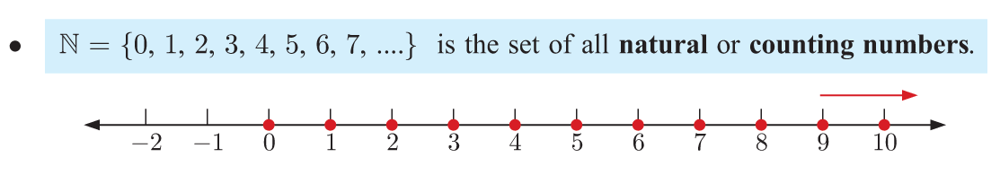
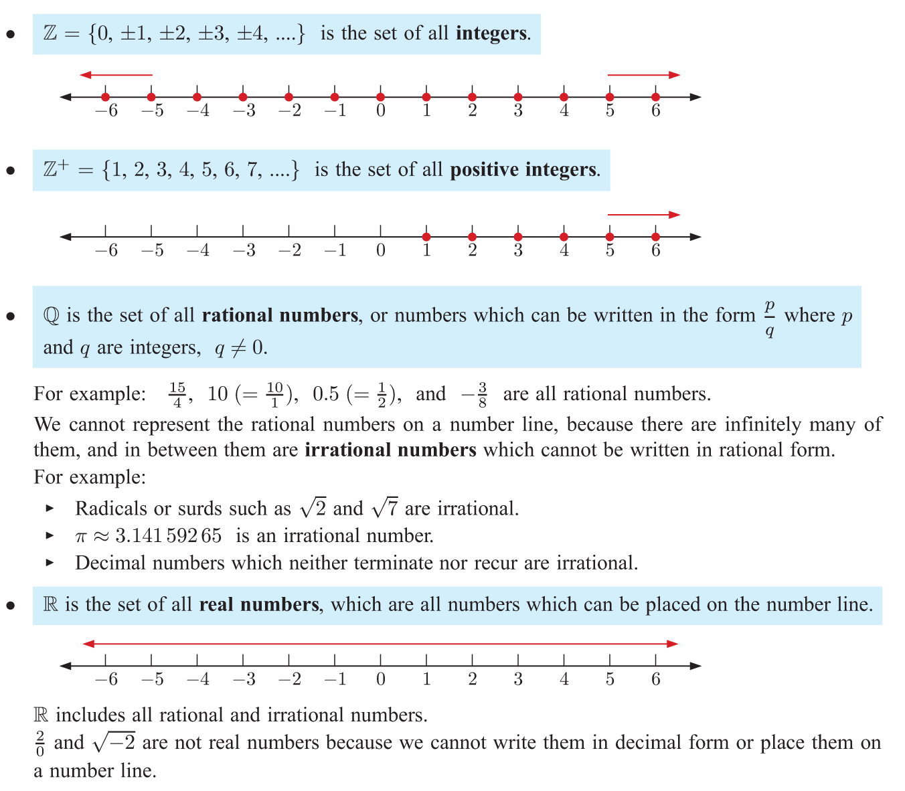
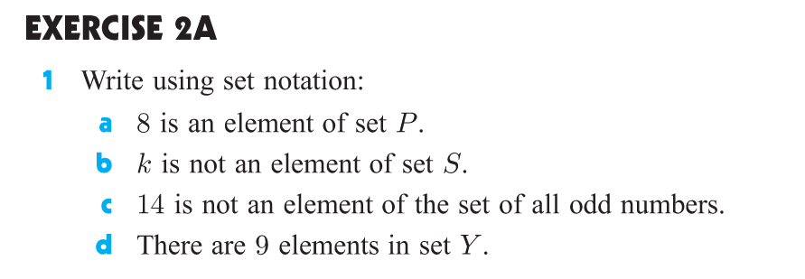
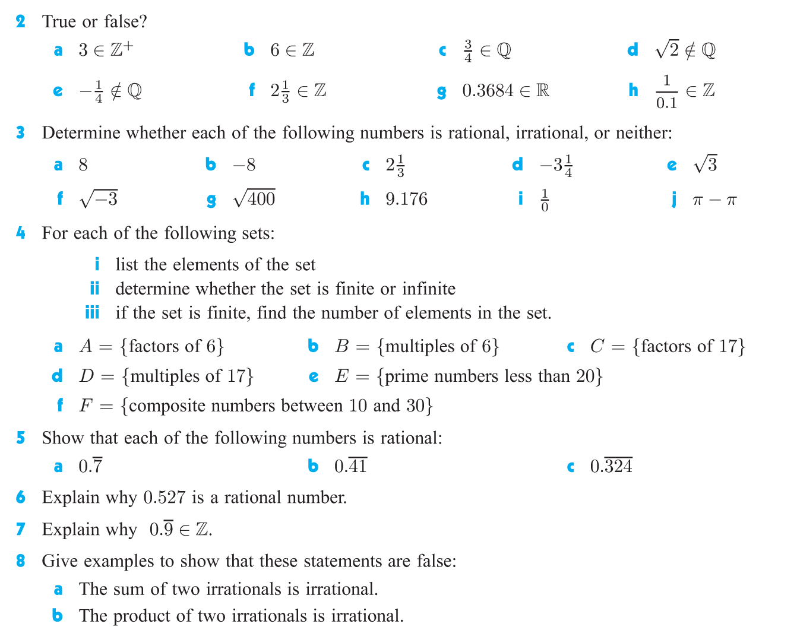

# Chapter 2 - Sets and Venn Diagrams

## 2.1 - Number Sets

### Definition 2.1.1 (Set)

* A **set** is a collection of objects. 

### Example 2.1.2

* The set of vowels: $V = \{a, e, i, o, u\}$
* The set of all positive integers: $\mathbb{Z}^+ = \{1, 2, 3, 4, \ldots\}$
* The set of all positive even integers: $E = \{2, 4, 6, 8, \ldots\}$

**Question:** Can you think of a set that contains only one element?

### Definition 2.1.3 (Element)

* The objects in a set are called **elements** or **members** of the set.

In mathematics, we use $\in$ to denote that an element is in a set, and $\notin$ to denote that an element is not in a set.

### Example 2.1.4

Let $V = \{a, e, i, o, u\}$ be the set of vowels.
* a $\in$ V
* b $\notin$ V

Let $\mathbb{Z}^+$ be the set of all positive integers.
* 1 $\in$ $\mathbb{Z}^+$
* -1 $\notin$ $\mathbb{Z}^+$

Let $E = \{2, 4, 6, 8, \ldots\}$ be the set of all positive even integers.
* 2 $\in$ E
* 3 $\notin$ E

### Definition 2.1.5 (Empty Set)

* The set that contains no elements is called the **empty set**.

We use $\emptyset$ or $\{\}$ to denote the empty set.

### Exercise 2.1.6

* Is $1$ an element of the empty set?
* Is anythng an element of the empty set?

### Definition 2.1.7 （Cardinality）

* The **cardinality** of a set is the number of elements in the set.

We use $|S|$ or $n(S)$ to denote the cardinality of a set $S$.

### Example 2.1.8

Let $V = \{a, e, i, o, u\}$ be the set of vowels.
* $|V| = 5$
* The cardinality of the set of vowels is 5.

We say that $V$ is a **finite set**.

Let $\mathbb{Z}^+$ be the set of all positive integers.
* $|\mathbb{Z}^+| = \infty$

We say that $\mathbb{Z}^+$ is an **infinite set**.

### Example 2.1.9 (Special Sets)

### Exercise 2.1.10

## 2.2 - Interval Notation

### Definition 2.2.1 (Interval)

An **interval** is a set of real numbers with the property that any number that lies between two numbers in the set is also included in the set.

* **Open Interval:** $(a, b) = \{x | a < x < b, x \in \mathbb{R}\}$
* **Closed Interval:** $[a, b] = \{x | a \leq x \leq b, x \in \mathbb{R}\}$
* **Half-Open Interval:** $[a, b) = \{x | a \leq x < b, x \in \mathbb{R}\}$
* **Half-Open Interval:** $(a, b] = \{x | a < x \leq b, x \in \mathbb{R}\}$

where $\{x \in \mathbb{R} | a < x < b\}$ is read as "the set of all $x$ in the real numbers such that $a < x < b$".

### Example 2.2.2

There can also be intervals where $x$ is a integer, or a natural number, or a rational number, etc.

* $(1, 2) = \{x | 1 < x < 2, x \in \mathbb{R}\}$
