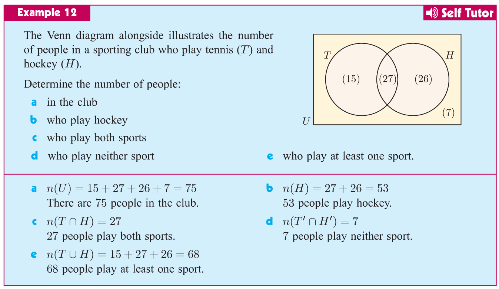

# Chapter 2 - Sets and Venn Diagrams

## 2.1 - Number Sets

### Definition 2.1.1 (Set)

* A **set** is a collection of objects. 

### Example 2.1.2

* The set of vowels: $V = \{a, e, i, o, u\}$
* The set of all positive integers: $\mathbb{Z}^+ = \{1, 2, 3, 4, \ldots\}$
* The set of all positive even integers: $E = \{2, 4, 6, 8, \ldots\}$

**Question:** Can you think of a set that contains only one element?

### Definition 2.1.3 (Element)

* The objects in a set are called **elements** or **members** of the set.

In mathematics, we use $\in$ to denote that an element is in a set, and $\notin$ to denote that an element is not in a set.

### Example 2.1.4

Let $V = \{a, e, i, o, u\}$ be the set of vowels.
* a $\in$ V
* b $\notin$ V

Let $\mathbb{Z}^+$ be the set of all positive integers.
* 1 $\in$ $\mathbb{Z}^+$
* -1 $\notin$ $\mathbb{Z}^+$

Let $E = \{2, 4, 6, 8, \ldots\}$ be the set of all positive even integers.
* 2 $\in$ E
* 3 $\notin$ E

### Definition 2.1.5 (Empty Set)

* The set that contains no elements is called the **empty set**.

We use $\emptyset$ or $\{\}$ to denote the empty set.

### Exercise 2.1.6

* Is $1$ an element of the empty set?
* Is anythng an element of the empty set?

### Definition 2.1.7 （Cardinality）

* The **cardinality** of a set is the number of elements in the set.

We use $|S|$ or $n(S)$ to denote the cardinality of a set $S$.

### Example 2.1.8

Let $V = \{a, e, i, o, u\}$ be the set of vowels.
* $|V| = 5$
* $n(V) = 5$
* The cardinality of the set of vowels is 5.

We say that $V$ is a **finite set**.

Let $\mathbb{Z}^+$ be the set of all positive integers.
* $|\mathbb{Z}^+| = \infty$
* $n(\mathbb{Z}^+) = \infty$
* The cardinality of the set of all positive integers is infinity.

We say that $\mathbb{Z}^+$ is an **infinite set**.

### Example 2.1.9 (Special Sets)

### Exercise 2.1.10

## 2.2 - Interval Notation

### Definition 2.2.1 (Interval)

An **interval** is a set of real numbers with the property that any number that lies between two numbers in the set is also included in the set.

* **Open Interval:** $(a, b) = \{x | a < x < b, x \in \mathbb{R}\}$
* **Closed Interval:** $[a, b] = \{x | a \leq x \leq b, x \in \mathbb{R}\}$
* **Half-Open Interval:** $[a, b) = \{x | a \leq x < b, x \in \mathbb{R}\}$
* **Half-Open Interval:** $(a, b] = \{x | a < x \leq b, x \in \mathbb{R}\}$

where $\{x \in \mathbb{R} | a < x < b\}$ is read as "the set of all $x$ in the real numbers such that $a < x < b$".

### Example 2.2.2

There can also be intervals where $x$ is a integer, or a natural number, or a rational number, etc.

* $\{x | a \leq x \leq b, x \in \mathbb{N}\}$
* $\{x | a \leq x \leq b, x \in \mathbb{Q}\}$

However, there are no simple notations for these intervals.

### Exercise 2.2.3

## 2.3 - Subsets and Complements

### Definition 2.3.1 (Subset)

* A set $A$ is a **subset** of a set $B$ if every element of $A$ is also an element of $B$.
* We use $A \subseteq B$ to denote that $A$ is a subset of $B$.
* If not every element of $A$ is an element of $B$, then $A$ is not a subset of $B$, denoted by $A \not\subseteq B$.

### Example 2.3.2

Let $A = \{1, 2, 3\}$, $B = \{1, 2, 3, 4, 5\}$, and $C = \{2, 4, 6\}$.
* $A \subseteq B$
* $C \not\subseteq B$
* $B \subseteq \mathbb{Z}^+$
* $B \subseteq B$

### Exercise 2.3.3

### Definition 2.3.4 (Complement)

Let $U$ denote the **universal set**, which usually refers to the set of all elements under consideration.

* The **complement** of a set $A$ is the set of all elements in $U$ that are not in $A$.
* We use $A^{\prime}$ to denote the complement of $A$, hence
        $$A^{\prime} = \{x | x \notin A, x \in U \}$$

### Example 2.3.5

Let $U = \{1, 2, 3, 4, 5, 6\}$, $A = \{1, 2, 3\}$, and $B = \{2, 4, 6\}$.

* $A^{\prime} = \{4, 5, 6\}$
* $B^{\prime} = \{1, 3, 5\}$

### Exercise 2.3.5

## 2.4 - Venn Diagrams

### Definition 2.4.1 (Venn Diagram)

A **Venn diagram** is a diagram that uses circles to represent sets and their relationships.
It consists of a rectangle that represents the universal set $U$ and circles that represent sets that are subsets of $U$.

### Example 2.4.2

### Exercise 2.4.3

## 2.5 - Set Operations

### Definition 2.5.1 (Union)

* The **union** of two sets $A$ and $B$ is the set of all elements that are in $A$ or $B$ or both.
* We use $A \cup B$ to denote the union of $A$ and $B$.

### Definition 2.5.2 (Intersection)

* The **intersection** of two sets $A$ and $B$ is the set of all elements that are in both $A$ and $B$.
* We use $A \cap B$ to denote the intersection of $A$ and $B$.

### Definition 2.5.3 (Disjoint)

* Two sets $A$ and $B$ are **disjoint** or **mutually exclusive** if $A \cap B = \emptyset$.
* It means that $A$ and $B$ have no elements in common.

## 2.6 - Expressing Number of Elements in a Set using Venn Diagrams

Sometimes it is too difficult to count the number of elements in a set by listing them out.
In this case, we can just put the number of elements in the set in the corresponding region of the Venn diagram.

## 2.7 - Solving Set Problems using Venn Diagrams

## Review Exercises

