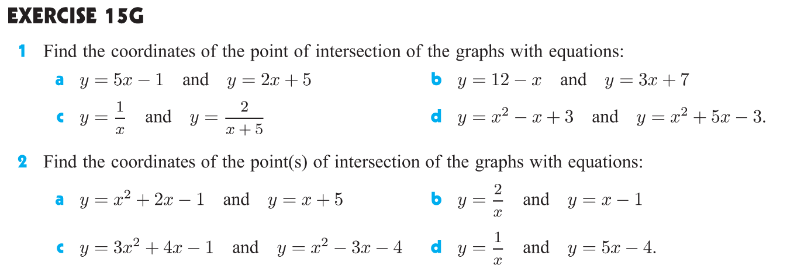

# Relations and Functions

## Introduction

When two variables are connected, we often use a relation or a function to describe the relationship.

## Relations

A relation may be a finite number of ordered pairs.
For example: 

$$ \{ (2, 8), (3, 8), (5, 12), (7, 14) \}, $$

or an infinite number of ordered pairs just like the above example.

` A relation is any set of points which connect two variables. `

## Domain and Range

` The domain of a relation is the set of all possible input values (x-values) of the relation. `

` The range of a relation is the set of all possible output values (y-values) of the relation. `

The domain and range of a relation are often described using **interval notation**.

Consider the following example:

## Functions

A function is a relation in which no two different ordered pairs have the same first element.

## Function Notation

For any function $f$, the notation $f(x)$ represents the output value of the function when the input is $x$.

In other words, $f(x)$ is the value of the function when $x=a$.

## Domain of a Function

The domain of a function is the set of all possible input values (x-values) for which the function is defined.

For example:

* The domain of the function $f(x) = \sqrt{x}$ is $\{ x| x \geq 0, x \in \mathbb{R} \}$, since $\sqrt{x}$ has meaning only when $x \geq 0$.
* The domain of the function $g(x) = \frac{1}{x}$ is $\{ x| x \neq 0, x \in \mathbb{R} \}$, since division by zero is undefined.

## Composite Functions

Sometimes functions are built by combining two or more functions. These are called composite functions.

For example, consider $f(x) = 2 \sqrt(x)$.

Using the technique of substitution, we can write $f(x+3) = 2 \sqrt(x+3)$.

If we let $g(x) = x+3$, then $f(g(x)) = 2 \sqrt(g(x)) = 2 \sqrt(x+3)$.

So, the function $f(g(x)) = 2 \sqrt(x+3)$ is composed of the functions $f(x) = 2 \sqrt(x)$ and $g(x) = x+3$.

## Inverse Functions

Exercise:

## When Functions Meet

## Review

