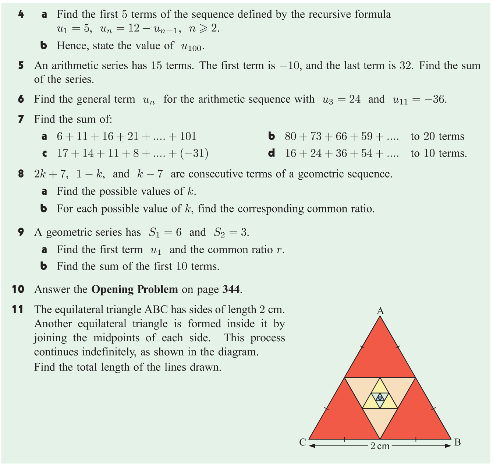

# Number Sequences 

In mathematics, a number sequence is a list of numbers arranged in a specific order. Number sequences can be finite or infinite, and they can follow different patterns or rules.

**Examples of a number sequence:**

1. The sequence of natural numbers: 1, 2, 3, 4, 5, ...
2. The sequence that starts with 2 and increases by 3 each time: 2, 5, 8, 11, 14, ...
3. The sequence that has an explicit formula for $n = 1, 2, 3, 4, ...$
        $$u_n = 2n + 3$$ 
    * $u_n$ is the $n^{th}$ term of the sequence.
    * What is the 5th term of the sequence?
4. The sequence that has a recursive formula. For $n = 1$
        $$u_1 = 2,$$
        and the following terms are given by the recursive formula:
        $$u_{n+1} = u_n + 3$$
    * $u_n$ is the $n^{th}$ term of the sequence.
    * What is the 5th term of the sequence?

**Fibonacci Sequence:**

The Fibonacci sequence is a famous sequence of numbers in which each term is the sum of the two preceding terms. It starts with 1 and 1, and after that, each term is the sum of the two preceding terms.

The Fibonacci sequence can be written as:

$$1, 1, 2, 3, 5, 8, 13, 21, 34, 55, 89, ... $$

* What is the 10th term of the Fibonacci sequence?
* Can you come up with a recursive formula for the Fibonacci sequence?

$$u_1 = 1, u_2 = 1, ~~ u_n = u_{n-1} + u_{n-2} ~~\text{for}~~ n \geq 3 $$

* I can't even come up with the explicit formula for the Fibonacci sequence. Strange things happen in mathematics.

$$ u_n = \frac{1}{\sqrt{5}} \left( \left( \frac{1 + \sqrt{5}}{2} \right)^n - \left( \frac{1 - \sqrt{5}}{2} \right)^n \right) $$

For the rest of the chapter, we will use **explicit formulas** or **recursive formulas** to describe a sequence, whichever is **more convenient**.

## Arithmetic Sequences

An arithmetic sequence is a sequence of numbers in which the difference between any two consecutive terms is constant. The constant difference is called the common difference.

The general form of an arithmetic sequence is:

$$u_1, u_1 + d, u_1 + 2d, u_1 + 3d, ...$$

where $u_1$ is the first term and $d$ is the common difference.

The $n^{th}$ term (general term) of an arithmetic sequence can be found using the **explicit formula**:

$$u_n = u_1 + (n - 1)d$$

where $u_n$ is the $n^{th}$ term, $u_1$ is the first term, $d$ is the common difference, and $n$ is the term number.

The $n^{th}$ term of an arithmetic sequence can also be found using the **recursive formula**:

$$u_1 = a, ~~~ u_{n+1} = u_n + d$$

where $u_1$ is the first term, $a$ is the first term, $d$ is the common difference, and $n$ is the term number.

**Think about them:** 

1. what is the sum of the first 100 terms of the arithmetic sequence with the first term 1 and the common difference 1?
2. what is the sum of the first k terms of the arithmetic sequence with the first term $u_1$ and the common difference $d$?

## Geometric Sequences

A geometric sequence is a sequence of numbers in which each term is found by multiplying the previous term by a constant ratio. The constant ratio is called the common ratio.

The general form of a geometric sequence is:

$$u_1, u_1r, u_1r^2, u_1r^3, ...$$

where $u_1$ is the first term and $r$ is the common ratio. 
$r$ is called the common ratio because the ratio of any term to the previous term is always $r$.

**Investigate:**    

For a geometric sequence with first term $u_1$ and common ratio $r$, the $n^{th}$ term (general term) can be found using the **explicit formula**:

$$u_n = u_1r^{n-1}$$

## Series

A series is the sum of the terms of a sequence. There are different types of series, such as arithmetic series and geometric series, which are formed by adding the terms of arithmetic and geometric sequences, respectively.

For a finite sequence $u_1, u_2, u_3, ..., u_n$, the sum of the terms is called a series and is denoted by $S_n$.

$$ S_n = u_1 + u_2 + u_3 + ... + u_n $$

For example, consider the arithmetic sequence $2, 5, 8, 11, 14$. 
The corresponding series is $2 + 5 + 8 + 11 + 14$, which can be calculated as $40$.

$$ S_5 = 2 + 5 + 8 + 11 + 14 = 40 $$

**Think about them:**

* What is the sum of a finite arithmetic series with the first term $u_1 = 1$, the common difference $d = 2$, and the number of terms $n = 10$?
* What is the sum of a finite arithmetic series with the first term $u_1$, the common difference $d = 2$, and $n$ terms?

## Arithmetic Series

An arithmetic series is the sum of the terms of an arithmetic sequence. The sum of the first $n$ terms of an arithmetic sequence can be calculated using the formula:

$$ S_n = \frac{n}{2} \left(u_1 + u_n \right) $$

where $S_n$ is the sum of the first $n$ terms, $u_1$ is the first term, $d$ is the common difference, and $n$ is the number of terms.

**Examples:**

1. An arithmetic sequence has 8 terms. The first term $u_1 = 3$, and the last term $u_8 = 17$. Find the sum of the sequence.

2. Find the sum of $1 + 5 + 9 + 13 + ...$ up to 30 terms.

3. Find the sum of $6 + 10 + 14 + 18 + ... + 102$.

**Think about them:**

Is it possible to find the sum of an infinite arithmetic series?

## Geometric Series

A geometric series is the sum of the terms of a geometric sequence. The sum of the first $n$ terms of a geometric sequence can be calculated using the formula:

$$ S_n = \frac{u_1(1 - r^n)}{1 - r}, \quad r \neq 1$$

where $S_n$ is the sum of the first $n$ terms, $u_1$ is the first term, $r$ is the common ratio, and $n$ is the number of terms.

**Proof:**

Let's consider a geometric sequence with the first term $u_1$ and the common ratio $r$. The $n^{th}$ term of the sequence is given by:

$$ u_n = u_1r^{n-1} $$

The sum of the first $n$ terms of the sequence is:

$$ S_n = u_1 + u_1r + u_1r^2 + ... + u_1r^{n-1} $$

Multiplying both sides by $r$ gives:

$$ rS_n = u_1r + u_1r^2 + u_1r^3 + ... + u_1r^n $$

Subtracting the second equation from the first equation gives:

$$ S_n - rS_n = u_1 - u_1r^n $$

$$ S_n(1 - r) = u_1(1 - r^n) $$

$$ S_n = \frac{u_1(1 - r^n)}{1 - r} $$

**Examples:**

1. Find the sum of $3 + 6 + 12 + 24 + ...$ up to 10 terms.

2. Find the sum of $8 - 4 + 2 - 1 + ...$ up to 7 terms.

**Think about them:**

Is it possible to find the sum of an infinite geometric series?

## Infinite Geometric Series

If the common ratio $r$ of a geometric series is between -1 and 1, the series converges to a finite value as the number of terms approaches infinity. The sum of an infinite geometric series can be calculated using the formula:

$$ S = \frac{u_1}{1 - r}, \quad |r| < 1 $$

where $S$ is the sum of the infinite series, $u_1$ is the first term, and $r$ is the common ratio.

**Examples:**

1. Find the sum of $2 + 1 + \frac{1}{2} + \frac{1}{4} + ...$.

## Assignment

1. An arithmetic sequence has $S_1 = 4$ and $S_2 = 11$. Find $S_40$.

2. Consider the series $4+9+19+ ... + 119$. 
    * Find the number of terms in the series.
    * Find the sum of the series.

3. Jim is saving money to buy a new computer. He puts $20 in the bank in the first week, $25 in the second week, $30 in the third week, and so on. 
    * How much money will he put in the bank in the 10th week?
    * How much money will he have saved after 20 weeks?
    * The computer costs $800. How many weeks will it take for Jim to save enough money to buy the computer?

4. A geometric sequence has $u_1 = 3$ and $S_2 = 6$. Find $S_5$.

5. A geometric sequence has $S_1 = 2$ and $S_2 = 3$. 
    * Find the common ratio of the sequence.
    * Find the first term of the sequence.
    * Find the sum of the first 10 terms of the sequence.

6. A geometric series has first term $u_1$ and common ratio $r = -1$.
    * Find $S_n$ for all $n$.

7. Decide whether the following infinite geometric series converge or diverge. If they converge, find the sum.
    * $1 + \frac{1}{2} + \frac{1}{4} + \frac{1}{8} + ...$
    * $2 - 4 + 8 - 16 + ...$

8. Without evaluating the sums, explain why 
    $$ 8 - 4 + 2 - 1 + \frac{1}{2} - \frac{1}{4} + ... = 4 + 1 + \frac{1}{4} + ... $$
    Evaluate the sum on both sides and compare the results.

