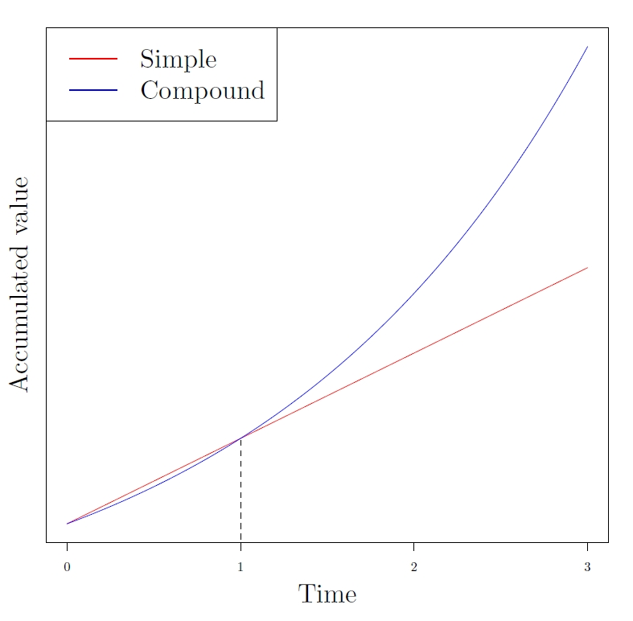

# Time Value of Money - How to be a mortgage expert

---

## Example

Assume an annual interest rate of 5%.

1. If you have $100 today, how much will it be worth in one year?

$$
100 \times (1 + 0.05) = 105
$$

2. If you need $100 in one year, how much should you save today?

$$
\frac{100}{1 + 0.05} = 95.24
$$

**Some questions to think about:**
- What if you save $100 today, how much will it be worth in 10 years?

- What if you need $100 in 10 years, how much should you save today?


---

## Interest Rate

- **Interest rate: 5% pa**
  - **5%**: the interest is 5% of principal
  - **pa** (per annum): the interest is paid annually

## Interest Rate Example

An investor deposits $10,000 in a bank account that pays interest at a rate of 5% *pa*.

- After 1 year, the interest earned by the investor is:
  $$
  \$10,000 \times 0.05 = \$500
  $$

- The investor's bank balance after 1 year is:
  $$
  \$10,000 + \$500 = \$10,500
  $$


---

## Interest Rate Example

| Year | Principal | Interest | Total |
|------|-----------|----------|-------|
| 0    | $10,000   | $0       | $10,000 |
| 1    | $10,000   | $500     | $10,500 |


## What happens after 2 years?

- **Simple interest**: Interest does not earn interest
    - Interest is calculated on the principal amount only
- **Compound interest**: Interest itself earns interest
    - Interest is calculated on the current total amount (principal + interest)


---

## Simple Interest

- **Simple interest**: interest does not earn interest

An investor deposits $C$ in a bank account that pays simple interest at a rate of $i$% *pa*

- After $n$ years, the interest earned by the investor is:
  $$
  \underbrace{C \times i + C \times i + \cdots + C \times i}_{n} = nCi
  $$

- Accumulated value of $C$ today at time $n$ is:
  
  $$
  AV = C + nCi = C(1 + ni)
  $$

- $n$ can be a non-integer

---


## Compound Interest

- **Compound interest**: interest itself earns interest

An investor deposits $10,000$ in a bank account that pays compound interest at a rate of 5% pa.

- After 1 year, the investor's bank balance is:
  $10,000 \times (1 + 0.05) = 10,500$

- After 2 years, the investor's bank balance is:
  $10,500 \times (1 + 0.05) = 11,025$
  $= 10,000 \times (1 + 0.05) \times (1 + 0.05)$
  $= 10,000 \times 1.05^2$

---

## Compound Interest

- After $3$ years, the investor's bank balance is:
  $10,000 \times (1 + 0.05)^2 \times (1 + 0.05) = 11,576.25$

| Year | Principal | Interest | Total |
|------|-----------|----------|-------|
| 0    | $10,000   | $0       | $10,000 |
| 1    | $10,000   | $500     | $10,500 |
| 2    | $10,500   | $525     | $11,025 |
| 3    | $11,025   | $551.25  | $11,576.25 |
| ...  | ...       | ...      | ...     |

---

## Compound Interest

An investor deposits $C$ in a bank account that pays compound interest at a rate of $i$% *pa*

- After $n$ years, the investor's bank balance is:
  $$
  AV = C \underbrace{\times (1+i) \times (1+i) \times \cdots \times (1+i)}_{n} = C\times (1+i)^n
  $$

- After $n$ years, the interest earned by the investor is:
  $$
  AV - C = C\times (1+i)^n - C
  $$

- $n$ can be a non-integer

---

## Simple vs. Compound Interests

- Accumulated value of $C$ with simple interest rate $i$ pa after $n$ years:
  $$
  C(1 + ni)
  $$

- Accumulated value with compound interest rate $i$ pa after $n$ years:
  $$
  C(1 + i)^n
  $$

- Actively reinvest interest yields a higher accumulated deposit!
  $$
  11,576.25 > 11,500
  $$

---

## Simple vs. Compound Interests

For the same principal, interest rate, and time period:

- Simple interest follows a straight line
- Compound interest follows an exponential curve

Compound interest grows faster **after the first period** (Why?).



---

## Account Value as a Function of Time

Let $A(t)$ be the account value at time $t$ for a deposit at time $0$. Here:

- $t$ is the time in years
- $A(t)$ is a value that depends on $t$

*Note*: Usually we write $y = f(x)$ to indicate 

- $y$ is a dependent variable that depends on $x$
- $f$ is a function, or a relationship to get $y$ from $x$
- $x$ is a independent variable


---

## Accumulation Factor

- For $t_1 < t_2$, we define $A(t_1, t_2)$ to be the value at time $t_2$ of an investment of 1 at time $t_1$

  $$
  t_1 \rightarrow t_2
  $$
  $$
  1 \rightarrow A(t_1, t_2)
  $$

- By proportion, the accumulated value of deposit $C$ from time $t_1$ to time $t_2$ is $C \cdot A(t_1, t_2)$

  $$
  t_1 \rightarrow t_2
  $$
  $$
  C \rightarrow C \cdot A(t_1, t_2)
  $$

- $A(t_1, t_2)$ is a function of two variables: $t_1$ and $t_2$, that is, its value depends on the two times, $t_1$ (the starting time) and $t_2$ (the ending time).

---

## Accumulation Factor

In other words,

$$
A(t_1, t_2) = \frac{A(t_2)}{A(t_1)}
$$


Where:
- $A(t_1, t_2)$ is the accumulation factor
- $A(t_1)$ is the amount at time $t_1$
- $A(t_2)$ is the amount at time $t_2$

---

## Accumulation Factor

The accumulation factor is a "black box" to calculate the money received by customers:

$$
C \text{ at } t_1 \xrightarrow{A(t_1, t_2)} CA(t_1, t_2) \text{ at } t_2
$$

- As an mortgage expert, we should design the "black box"

- What is the functional form of $A(t_1, t_2)$ and $A(n)$ using **Simple interest**?

- What is the functional form of $A(t_1, t_2)$ and $A(n)$ using **Compound interest**?

---

## Accumulation Factor - Simple Interest

Time:

$$
t_1 \rightarrow t_2
$$

Account Value:
$$
1 \rightarrow 1 + (t_2 - t_1)i
$$

The accumulation factor from time $t_1$ to time $t_2$ for simple interest:

$$
A(t_1, t_2) = 1 + (t_2 - t_1)i
$$

### Be careful!

The accumulation of $(1 + t_1i)$ at $t_1$ with simple interest is not $(1 + t_2i)$ at time $t_2$.

---

## Accumulation Factor - Compound Interest

Time:

$$
t_1 \rightarrow t_2
$$

Account Value:

$$
1 \rightarrow (1 + i)^{t_2 - t_1}
$$

The accumulation factor from time $t_1$ to time $t_2$ for compound interest:

$$
A(t_1, t_2) = (1 + i)^{t_2 - t_1}
$$

---

## Accumulation Factor

- The abbreviated notation $A(n)$ is used for $A(0, n)$

- The accumulation factor from time 0 to time $n$ for simple interest:
  
  $$
  A(n) = \frac{1 + ni}{1} = 1 + ni
  $$

- The accumulation factor from time 0 to time $n$ for compound interest:
  
  $$
  A(n) = \frac{(1 + i)^n}{1} = (1 + i)^n
  $$

---

## Example

The accumulation factor $A(5) = 2.5$. Calculate the accumulated value of an investment of $1,000$ at time 0 after 5 years.

- $t_1 = 0$ and $t_2 = 5$
- $A(5) = 2.5$
- Amount at time 0 = $1,000$


## Answer

$$
\text{Amount at time 5} = A(5) \times \text{Amount at time 0}
= 2.5 \times 1,000 = 2,500
$$

---

## Example

An investment of $1,000$ accumulates to $2,500$ after 5 years. Calculate the accumulation factor $A(5)$.

## Answer

$$
A(5) = \frac{\text{Amount at time 5}}{\text{Amount at time 0}}
= \frac{2,500}{1,000} = 2.5
$$

---

## Python Implementation

We will use Python functions to implement the accumulation factor.

Fill in the blanks:

```python
def acc_factor(t1, t2, i, simple=True):
    if simple:
        return ___
    else:
        return ___
```

---

## Python Implementation

We will use Python functions to implement the accumulation factor.


```python
def acc_factor(t1, t2, i, simple=True):
    if simple:
        return 1 + (t2 - t1) * i
    else:
        return (1 + i) ** (t2 - t1)
```

---

## Practice Problems

### Basic

1. Using the accumulation factor, calculate the accumulated value of an investment of $1,000$ at time 0 after 5 years using simple interest of 5% pa.

2. Using the accumulation factor, calculate the accumulated value of an investment of $1,000$ at time 0 after 5 years using compound interest of 5% pa.

---

### Intermediate

3. Using the accumulation factor, calculate the accumulated value at 5.5 years of an investment of $1,000$ at year 3 using simple interest of 1.5% pa.

4. Using the accumulation factor, calculate the accumulated value at 5.5 years of an investment of $1,000$ at year 3 using compound interest of 1.5% pa.

---

### Advanced

5. If you need $1,000$ at time 5, how much should you deposit at time 0 using simple interest of 5% pa?

6. If you need $1,000$ at time 5, how much should you deposit at time 0 using compound interest of 5% pa?


